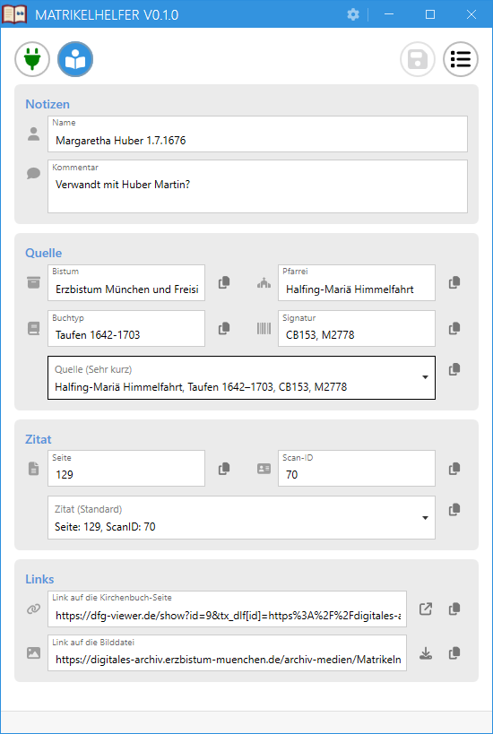
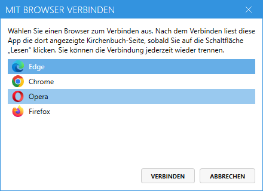
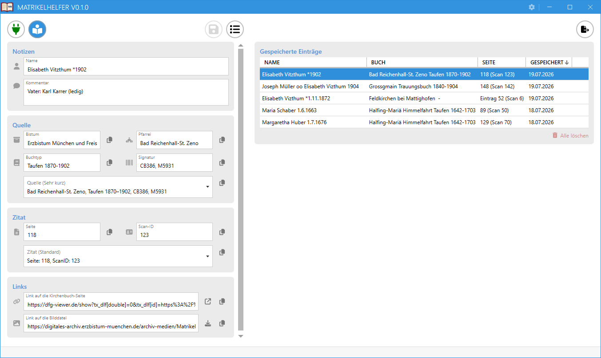
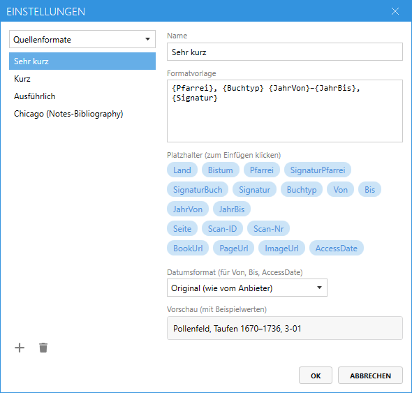

{ .banner }

# Matrikelhelfer – Benutzerhandbuch

## Einführung

*Matrikelhelfer* unterstützt Sie bei der Ahnenforschung in Online-Kirchenbüchern. Während Sie im Browser einen Kirchenbuch-Scan betrachten, holt die App auf Knopfdruck alle Angaben, die Sie für eine saubere Quellenangabe brauchen:

- **Land, Bistum und Pfarrei**
- **Buchtyp und Zeitraum** (z. B. Taufen 1670–1736)
- **Signatur** (bei Archiven mit geteilter Signatur auch getrennt nach Pfarrei-Bestand und Buch)
- **Scan-Nummer und Scan-ID**
- **Links** auf die Seite, das Buch und die Bilddatei

Aus diesen Angaben erzeugt die App fertig formatierte, mit einem Klick kopierbare **Quellen- und Zitatangaben** – in frei definierbaren Formaten, passend zur Arbeitsweise von Genealogie-Programmen (eine *Quelle* pro Kirchenbuch, dazu je Fundstelle ein *Zitat*).

Interessante Funde können Sie außerdem mit Name und Kommentar versehen und dauerhaft **speichern**. Das ist besonders praktisch, wenn Sie beim Blättern auf etwas stoßen, für das gerade keine Zeit ist: Fund speichern, kurz benennen und kommentieren – und später über die Liste der gespeicherten Einträge gezielt wieder aufgreifen. Name und Kommentar helfen dabei, den Fund in der Liste wiederzufinden; ein Doppelklick auf den Eintrag öffnet die gespeicherte Seite wieder im Browser. Die gesammelten Einträge lassen sich zudem als **CSV-Datei** oder als **BibTeX-Bibliothek** für Ihr eigenes Archiv exportieren (siehe [Daten exportieren](#daten-exportieren)).

**Unterstützte Anbieter:**

- [Matricula Online](https://data.matricula-online.eu) – Kirchenbücher aus Deutschland, Österreich, Luxemburg u. a.
- **DFG-Viewer**-basierte Archive (`tx_dlf`), derzeit das [Digitale Archiv des Erzbistums München und Freising](https://digitales-archiv.erzbistum-muenchen.de)
- [**ARCHION**](https://www.archion.de) – das Portal der evangelischen Kirchenbücher. Hier müssen Sie in Ihrem Browser **angemeldet** sein (kostenpflichtiges Abonnement); *Matrikelhelfer* liest die Angaben dann aus der angezeigten Buchseite. Diese Unterstützung ist **neu und noch experimentell** – Rückmeldungen sind willkommen (siehe [Besonderheiten bei ARCHION](#lesen-einer-kirchenbuchseite)).

Die App erkennt den Anbieter automatisch an der Adresse der gerade angezeigten Browser-Seite.

---

## Schnellstart

1. Öffnen Sie im Browser eine Kirchenbuch-Scan-Seite (Matricula Online oder DFG-Viewer).
2. Klicken Sie in *Matrikelhelfer* auf das **Steckersymbol** und wählen Sie Ihren Browser aus.
3. Klicken Sie auf **Lesen** (Buchsymbol) – die Felder füllen sich mit den Angaben des Kirchenbuchs.
4. Tragen Sie im Feld **Seite** die handschriftliche Seitennummer ein (siehe [Quellen- und Zitate](#quellen--und-zitate)).
5. Kopieren Sie Quellen- und Zitatangabe mit den Kopier-Symbolen in Ihr Genealogie-Programm.
6. Optional: Name und Kommentar eintragen und den Fund mit **Speichern** (Diskette) dauerhaft ablegen.

---
## Benutzung von Matrikelhelfer

### Die Oberfläche im Überblick

Das Fenster besteht von oben nach unten aus:

1. **Werkzeugleiste** – links, in der Reihenfolge des Arbeitsablaufs: **Verbinden** (Steckersymbol) und **Lesen** (Buchsymbol); rechts **Speichern** (Diskettensymbol) und die Umschaltfläche für die **Liste der gespeicherten Einträge**. In der Titelleiste sitzen das **Fragezeichen** (öffnet dieses Handbuch) und das Zahnrad für die **Einstellungen**.
2. **Notizen** – die Felder **Name** und **Kommentar**, mit denen Sie einen Fund beschriften, bevor Sie ihn speichern.
3. **Quelle** – Bistum, Pfarrei, Buchtyp und Signatur des Kirchenbuchs sowie die fertige **Quellenangabe** (Auswahlliste mit Ihren Quellenformaten).
4. **Zitat** – das von Ihnen einzutragende Feld **Seite**, die **Scan-ID** sowie die fertige **Zitatangabe** (Auswahlliste mit Ihren Zitatformaten).
5. **Links** – die Adressen der Kirchenbuch-Seite und der Bilddatei.
6. **Statusleiste** – eine Zeile am unteren Rand für Hinweise und Fehlermeldungen (lange Meldungen werden gekürzt; halten Sie den Mauszeiger auf die Meldung, um den vollständigen Text zu sehen).

Die Abschnitte **Notizen**, **Quelle**, **Zitat** und **Links** sind als abgesetzte Karten gruppiert, und jedes Feld trägt links ein kleines Symbol, das kennzeichnet, worum es sich handelt (z. B. ein Archiv-Symbol beim Bistum, ein Kirchen-Symbol bei der Pfarrei). Die primäre Schaltfläche **Lesen** ist farblich hervorgehoben, damit sie sich von den übrigen Schaltflächen abhebt.

Jedes Anzeigefeld hat rechts ein **Kopier-Symbol**, das den Feldinhalt in die Zwischenablage legt.

 


---


### Mit einem Web-Browser verbinden

- Klicken Sie auf das **Steckersymbol**. Ein Auswahlfenster zeigt alle laufenden, unterstützten Browser (Chrome, Edge, Brave, Opera, Vivaldi, Firefox).
- Nach dem Verbinden wird das Steckersymbol **grün**; halten Sie den Mauszeiger darauf, sehen Sie, mit welchem Browser die App verbunden ist.
- Ein erneuter Klick auf das Steckersymbol trennt die Verbindung.

Die Verbindung ist rein lesend und **auf Abruf**: Die App liest die Adresszeile des Browsers nur in dem Moment, in dem Sie auf **Lesen** klicken – sie beobachtet Ihren Browser nicht dauerhaft.

Wird der verbundene Browser geschlossen, erkennt die App das beim nächsten **Lesen** und zeigt es in der Statusleiste an; verbinden Sie sich dann einfach neu.


<!-- Zeigt: Auswahlfenster mit laufenden Browsern samt Icons --> 

---

### Lesen einer Kirchenbuchseite

Ein Klick auf **Lesen** (Buchsymbol):

1. liest die Adresse des aktiven Browser-Tabs,
2. erkennt daran den Anbieter (Matricula, DFG-Viewer oder ARCHION),
3. lädt die Angaben des Kirchenbuchs und füllt alle Felder.

Beim Blättern im Scan (nächste/vorherige Seite im Viewer) genügt ein erneuter Klick auf **Lesen** – die App erkennt, dass es sich um dasselbe Buch handelt, und aktualisiert nur die Scan-Angaben, ohne die Seite neu aus dem Internet zu laden. Pro Buch und Sitzung wird nur einmal geladen; der Datenverkehr bleibt minimal.

**Wichtig:** Jeder Klick auf **Lesen** beginnt einen neuen Fund – alle Felder (auch Name, Kommentar und Seite) werden zuvor geleert. Enthalten die Notizfelder Eingaben, die noch nicht gespeichert wurden, fragt die App vorher nach (siehe [Funde speichern und verwalten](#funde-speichern-und-verwalten)).

Zeigt der Browser keine lesbare Kirchenbuch-Seite (z. B. eine Pfarrei-Übersichtsseite oder eine beliebige andere Website), meldet die Statusleiste „Keine unterstützte Kirchenbuch-Seite“ und die Felder bleiben leer.

> **Hinweis (Matricula):** Matricula gibt es in mehreren Sprachen (`…/de/…`, `…/en/…`). *Matrikelhelfer* liest die Angaben immer aus der deutschen Fassung – auch wenn Sie gerade die englische Seite betrachten –, damit Buchtyp, Signatur und die Datumsangaben zuverlässig erkannt werden. Die **Links** verweisen weiterhin auf die von Ihnen geöffnete Sprachfassung.

**Besonderheiten bei ARCHION**

[ARCHION](https://www.archion.de) unterscheidet sich von Matricula und dem DFG-Viewer:

- **Anmeldung nötig.** Die Buchdaten sind kostenpflichtig; Sie müssen im Browser bei ARCHION **angemeldet** sein, damit die Seite die Angaben anzeigt, die *Matrikelhelfer* ausliest. (*Matrikelhelfer* selbst meldet sich nicht an und überträgt keine Zugangsdaten – es liest nur die bereits angezeigte Seite.)
- **Kein Bild, keine Signatur, keine Scan-Nr.** ARCHION stellt diese Angaben nicht bereit. Die **Seite** tragen Sie wie gewohnt selbst ein.
- **Genaue Seitenlinks über den Permalink.** Beim normalen Blättern steht in der Adresszeile nur das Buch, nicht die einzelne Seite. Öffnen Sie im ARCHION-Viewer das **Permalink-Feld** (Link-Symbol in der Werkzeugleiste), *bevor* Sie auf **Lesen** klicken, dann übernimmt *Matrikelhelfer* den genauen Seiten-Permalink (`archion.de/p/…`) als Seitenlink. Ist das Feld geschlossen, wird stattdessen der Buch-Link verwendet.

Da diese Funktion neu und noch experimentell ist: Falls die Felderkennung bei einem Archiv nicht stimmt oder der Permalink nicht übernommen wird, freut sich der Autor über eine Rückmeldung über die [GitHub-Seite](https://github.com/luni64/Matrikelhelfer/issues).

---

### Quellen- und Zitate

Wissenschaftliche Texte und viele Genealogie-Programme unterscheiden zwischen der **Quelle** (z. B. einem Kirchenbuch) und dem **Zitat** (der konkreten Fundstelle in einer Quelle). Typischerweise werden sich mehrere Zitate auf eine Quelle beziehen. Aus den eingelesenen Angaben erzeugt *Matrikelhelfer* zwei fertige Texte – die **Quellenangabe** für das Buch und die **Zitatangabe** für die Fundstelle. 
Dieser Abschnitt erklärt beide sowie die verschiedenen Seiten- und Scan-Nummern, die dabei eine Rolle spielen.

- **Quellenangabe** – identifiziert das Buch, z. B. „Erzbistum München und Freising, Waging am See-St. Martin, Taufen 1846–1885, Signatur CB481, M7658.“
- **Zitatangabe** – die Fundstelle, z. B. „S. 12, ID: 007“.

Die Formatierung der beiden Angaben kann frei gewählt werden. Die Felder sind Auswahllisten: Aufgeklappt zeigen sie alle Ihre Formate, jeweils schon mit den Daten des aktuellen Fundes ausgefüllt – Sie wählen einfach die Variante, die Ihnen gefällt. Die Auswahl bleibt auch nach einem Neustart erhalten. Das Kopier-Symbol daneben legt den angezeigten Text in die Zwischenablage. Die angezeigten Formate können mit Hilfe von Formatvorlagen beliebig ergänzt oder bearbeitet werden (siehe [Formate bearbeiten](#formate-bearbeiten)).


Die Begriffe **Seite**, **Scan-ID** und **Scan-Nr** tauchen sowohl in der App als auch in den Formatvorlagen auf und bezeichnen Verschiedenes:

- **Scan-Nr** – die laufende Nummer des Scans im jeweiligen Viewer. Sie zählt alle Aufnahmen durch, inklusive Einband und Leerseiten.
- **Scan-ID** – die Beschriftung, die der Anbieter dem Scan gibt (bei Matricula z. B. „Pollenfeld 01. 007“). Pflegt ein Archiv keine Scan-IDs (z. B. das Erzbistum-München-Archiv), zeigt das Feld die Scan-Nummer.
- **Seite** – die originale **Seitennummer** im Kirchenbuch selbst. Auf diese Nummer beziehen sich auch die den Kirchenbüchern häufig beigefügten Register. Im Gegensatz zu Scan-Nr und Scan-ID ist die Seitennummer nicht vom Anbieter bzw. Viewer abhängig und sollte deshalb in einem Zitat bevorzugt angegeben werden. Da die Seitennummer typischerweise handschriftlich auf den Seiten eingetragen ist, müssen Sie sie manuell eintragen. Solange das Feld leer ist, zeigt es einen **roten Rand** als Erinnerung.

---

### Funde speichern und verwalten

Mit **Speichern** (Diskettensymbol) legen Sie den aktuell angezeigten Fund zusammen mit Ihren Notizen dauerhaft ab:

- **Name** – die gefundene Person, z. B. „Anna Maier, *1846“.
- **Kommentar** – Freitext: Warum ist diese Seite interessant? Mehrzeilige Eingaben sind möglich.

**Hinweise:**

- **Speichern** ist ausgegraut, solange der angezeigte Fund samt Notizen exakt einem bereits gespeicherten Eintrag entspricht – das verhindert versehentliche Doppel-Speicherungen. Dieselbe Seite mit anderem Namen oder Kommentar lässt sich jederzeit erneut speichern (mehrere Funde pro Seite sind normal).
- Enthalten Name, Kommentar oder Seite noch nicht gespeicherte Eingaben, warnt die App, bevor diese durch **Lesen** oder die Auswahl eines gespeicherten Eintrags verloren gehen.
- Die Einträge werden in `%APPDATA%\Matrikelhelfer\entries.json` gespeichert – eine gut lesbare Textdatei, die Sie einfach sichern können. Gespeichert werden nur die Rohdaten; die Quellen- und Zitatangaben werden bei der Anzeige stets mit Ihren **aktuellen** Formaten neu erzeugt.

**Die Liste der gespeicherten Einträge**



Die Umschaltfläche rechts in der Werkzeugleiste (Listensymbol) öffnet die **Liste der gespeicherten Einträge** in einem eigenen Bereich rechts neben den Feldern (das Fenster wird dazu breiter; die Trennlinie im Zwischenraum lässt sich mit der Maus verschieben). 

- Die Spalten der Liste lassen sich per Klick auf die Spaltenköpfe sortieren.
- Halten Sie den Mauszeiger auf eine Zeile, wird der **Kommentar** des Eintrags eingeblendet.
- **Einfacher Klick:** übernimmt den Eintrag in den Hauptbereich und zeigt die Felder an.
- Ein **Doppelklick** auf eine Zeile (oder Kontextmenü „Im Browser öffnen”) steuert zusätzlich den Browser zur Seite mit dem Scan des Eintrages. So lassen sich die Einträge bequem „durchblättern“.
- **Löschen:** Bewegen Sie die Maus über eine Zeile, erscheint rechts ein rotes **Papierkorb-Symbol** – ein Klick löscht diesen Eintrag sofort. Alternativ **Entf** oder das Kontextmenü „Eintrag löschen” für den ausgewählten Eintrag.
- **Alle löschen:** Die Schaltfläche unten in der Liste entfernt nach einer Sicherheitsabfrage **alle** gespeicherten Einträge auf einmal.

Löschen ist endgültig. Löschen Sie den gerade angezeigten Eintrag, werden auch die Hauptfelder geleert.

Bearbeiten Sie bei einem wieder angezeigten Eintrag die Notizen, können Sie ihn mit **Speichern** als weiteren Fund derselben Seite ablegen.


### Formate bearbeiten

Das **Zahnrad in der Titelleiste** öffnet den Formateditor. Links wählen Sie zunächst, welche Liste Sie bearbeiten möchten (**Quellenformate** oder **Zitatformate**), und darunter das einzelne Format; mit **+** und **Papierkorb** legen Sie Formate an bzw. löschen sie (das letzte Format einer Liste kann nicht gelöscht werden). Änderungen gelten erst nach **OK**; **Abbrechen** verwirft sie.

Rechts bearbeiten Sie das gewählte Format:

- **Name** – der Anzeigename in der Auswahlliste.
- **Formatvorlage** – der Text der Angabe mit `{Platzhaltern}`, die automatisch durch die Werte des Fundes ersetzt werden.
- **Platzhalter-Pillen** – ein Klick fügt den Platzhalter an der Schreibmarke ein. Halten Sie den Mauszeiger auf eine Pille, erscheint eine kurze Erklärung mit Beispielwert. Die vollständige Referenz steht im [Anhang](#anhang-platzhalter-referenz).
- **Datumsformat** – bestimmt, wie die Datums-Platzhalter `{Von}`, `{Bis}` und `{AccessDate}` ausgegeben werden (siehe unten unter **Datumsformate**).
- **Vorschau** – zeigt das Format live mit Beispielwerten.

Die Formate werden in `%APPDATA%\Matrikelhelfer\formats.json` gespeichert.


<!-- Zeigt: Einstellungsdialog mit Formatliste links, Editor mit Pillen-Zeilen, Datumsformat-Dropdown und Vorschau rechts -->

**Datumsformate**

Jedes Format hat sein eigenes Datumsformat – so kann ein englisches Zitierformat englische Datumsangaben verwenden, während Ihre deutschen Formate deutsch bleiben:

| Auswahl | Beispiel |
|---|---|
| Original (wie vom Anbieter) | „1. Januar 1670“ bzw. „01.01.1846“ – unverändert |
| Numerisch | 22.03.1845 |
| Deutsch lang | 22. März 1845 |
| GEDCOM deutsch | 22 MÄR 1845 |
| ISO | 1845-03-22 |
| Englisch lang | 22 March 1845 |
| Englisch (US) | Mar 22, 1845 |
| GEDCOM englisch | 22 MAR 1845 |

Kann ein Datum nicht als solches erkannt werden (z. B. „um 1650“), wird es unverändert übernommen – die App erfindet keine Datumsangaben.

**Platzhalter aufbereiten (`:clean`)**

Für technische Ausgaben – etwa den Zitierschlüssel einer [BibTeX-Datei](#daten-exportieren) – gibt es den Zusatz **`:clean`**. Schreiben Sie ihn hinter einen Platzhalternamen (z. B. `{Signatur:clean}`), wird der Wert in eine „schlüsseltaugliche“ Form gebracht:

- Umlaute werden umgeschrieben (ä→ae, ö→oe, ü→ue, ß→ss), sonstige Akzente entfernt.
- Leerzeichen, Kommas, Punkte usw. werden zu Unterstrichen; **Bindestriche bleiben erhalten** (z. B. „3-01“).
- Ist das Feld leer, erscheint `EMPTY`, damit die Lücke im Ergebnis auffällt.

Beispiel: `{Pfarrei:clean}` macht aus „Waging am See-St. Martin“ den Text `Waging_am_See-St_Martin`. So lassen sich eigene, eindeutige Schlüssel bauen, etwa `{Pfarrei:clean}_{Signatur:clean}`.

Unter den mitgelieferten Formaten finden Sie bereits ein Quellenformat **„BibTeX“** (ein `@misc`-Eintrag) und ein Zitatformat **„BibTeX (\cite)“**, die diesen Zusatz nutzen.

---

### Daten exportieren

**CSV-Export**

Das **Export-Symbol** über der Liste schreibt alle gespeicherten Einträge in eine CSV-Datei – gedacht für Ihr eigenes Langzeitarchiv, z. B. um Jahre später nachzusehen, ob Sie ein Buch schon einmal durchgearbeitet haben.

- Enthält alle Einzelfelder (inklusive der getrennten Signaturen und aller Links) **plus** die fertige Quellen- und Zitatangabe in den gerade gewählten Formaten.
- Das Format ist auf deutsches Excel abgestimmt (Semikolon-Trennung, UTF-8 mit BOM): Ein Doppelklick auf die Datei öffnet sie korrekt mit allen Umlauten; mehrzeilige Kommentare bleiben erhalten.

**BibTeX-Export**

**Was ist BibTeX?** BibTeX ist ein weit verbreitetes Format für Literaturverzeichnisse. Eine `.bib`-Datei ist im Grunde eine kleine **Datenbank Ihrer Quellen** – hier also der Kirchenbücher. Das Format stammt ursprünglich aus dem Textsatzsystem LaTeX, wird aber längst nicht nur dort verwendet: Über Literaturverwaltungs-Programme lassen sich die Einträge auch in gängige Textverarbeitungen wie Word einbinden (siehe unten).

Das **@-Symbol** über der Liste schreibt alle gespeicherten Funde in eine `.bib`-Datei. Dabei entsteht **ein Eintrag pro Kirchenbuch** – mehrere Funde im selben Buch werden zusammengefasst, denn ein Literaturverzeichnis listet *Quellen*, nicht einzelne Seiten. Erzeugt wird die Datei mit Ihrer Quellenformatvorlage namens **„BibTeX"**; ist dieses Format nicht (mehr) vorhanden, bietet die App an, die Formatvorlage neu zu erzeugen.

**Beispiel** – so sieht ein Eintrag in der erzeugten Datei aus:

```bibtex
@misc{Waging_am_See-St_Martin_CB481_M7658,
  title        = {Waging am See-St. Martin: Taufen 1846--1885},
  howpublished = {Erzbistum München und Freising, Signatur CB481, M7658},
  url          = {https://data.matricula-online.eu/de/...},
  urldate      = {2026-07-20}
}
```

Der **Zitierschlüssel** (`Waging_am_See-St_Martin_CB481_M7658`) beginnt mit der Pfarrei, damit Sie in einem Text sofort erkennen, worauf sich eine Zitierung bezieht – Signaturen kennt niemand auswendig. Die Schlüssel sind eindeutig; bei Bedarf können Sie sie in Ihrer `.bib`-Datei natürlich beliebig umbenennen.

**In Word (und anderen Textverarbeitungen) verwenden.** `.bib`-Dateien werden meist über ein **Literaturverwaltungs-Programm** eingebunden, das die Verbindung zur Textverarbeitung herstellt:

- **Zotero**, **JabRef** oder **Mendeley** – importieren die `.bib`-Datei und bringen Zusatzmodule für **Microsoft Word**, **LibreOffice Writer** und **Google Docs** mit, mit denen Sie Quellen einfügen und ein Literaturverzeichnis erzeugen.
- **BibTeX4Word** – ein Zusatzmodul direkt für Microsoft Word.
- In **LaTeX** binden Sie die Datei klassisch über `\bibliography{…}` bzw. `biblatex` ein.

Die Datei ist als **UTF-8 ohne BOM** gespeichert – so erwarten es LaTeX- und Literaturverwaltungs-Programme.

---

### Verknüpfungen zu Viewer und Bilddatei

Im untersten Abschnitt der Bedienoberfläche werden die folgenden beiden Links angezeigt:

- **Link auf die Kirchenbuch-Seite** – Verknüpfung auf die Kirchenbuchseite im zugehörigen Viewer (Matricula-online, DFG-Viewer...). Das Pfeil-Symbol öffnet den Viewer im aktuellen Tab des verbundenen Web-Browsers.
- **Link auf die Bilddatei** – die direkte Web-Adresse des eigentlichen Scans. Das Download-Symbol schlägt einen sprechenden Dateinamen vor (aus Bistum, Pfarrei, Buch, Signatur und Scan-ID) und speichert das Bild darunter.

Für Formatvorlagen stehen die beiden Links unter `{PageUrl}` und `{ImageUrl}` zur Verfügung. Zusätzlich können Sie auch `{BookUrl}` (Link auf das Buch, ohne Seitenangabe) verwenden.

---

## Tipps für die Praxis

- Tragen Sie die **Seite** direkt nach dem Lesen ein, solange Sie den Scan noch vor Augen haben – das rote Feld erinnert Sie daran.
- Nutzen Sie **kurze, klare Namensformen** im Notizfeld (z. B. „Anna Maier, *1846“), damit die Einträge in der Liste und im CSV-Export gut lesbar bleiben.
- Mehrere Funde auf derselben Seite? Einfach die Notizen ändern und erneut **Speichern** – jeder Fund wird ein eigener Eintrag.
- Exportieren Sie die Einträge gelegentlich als **CSV** und legen Sie die Datei zu Ihren Forschungsunterlagen; sichern Sie zusätzlich `entries.json` mit Ihrer normalen Datensicherung.
- Der **Doppelklick** auf einen gespeicherten Eintrag ist der schnellste Weg, eine früher gefundene Stelle wieder im Browser zu öffnen.

---

## Häufige Fragen (FAQ)

**Die Statusleiste meldet „Keine unterstützte Kirchenbuch-Seite“ – warum?**
Der aktive Browser-Tab zeigt keine lesbare Scan-Seite. Übersichtsseiten (Pfarrei, Bistum) enthalten keine Buchdaten – öffnen Sie ein konkretes Buch im Viewer und klicken Sie erneut auf **Lesen**.

**„Browser-Adressleiste konnte nicht gelesen werden“?**
Der verbundene Browser wurde möglicherweise geschlossen oder neu gestartet. Verbinden Sie sich über das Steckersymbol neu.

**Warum ist das Feld Seite nach jedem Lesen leer?**
Absichtlich – siehe [Quellen- und Zitate](#quellen--und-zitate): Die App übernimmt keine Scan-Nummern als Seitenzahlen; nur Ihre eigene Eingabe zählt.

**Warum ist Speichern ausgegraut?**
Entweder wurde noch keine Seite gelesen, oder der angezeigte Fund samt Notizen ist bereits exakt so gespeichert. Ändern Sie z. B. den Kommentar, wird Speichern wieder aktiv.

**Werden meine Daten irgendwohin übertragen?**
Nein. Die App liest nur die Adresszeile des von Ihnen gewählten Browsers und lädt die Buchdaten direkt beim jeweiligen Kirchenbuch-Anbieter. Alle gespeicherten Daten liegen lokal in `%APPDATA%\Matrikelhelfer`.

---

## Installation

*Matrikelhelfer* ist auf der [GitHub-Releases-Seite](https://github.com/luni64/Matrikelhelfer/releases) erhältlich – wahlweise als **Installer** (`Matrikelhelfer-…-Setup.exe`) oder als **portables ZIP-Archiv**. Voraussetzung ist Windows 10/11 sowie die [.NET-8-Desktop-Runtime](https://dotnet.microsoft.com/download/dotnet/8.0); der Installer bietet ihre Einrichtung bei Bedarf automatisch an.

---

## Anhang: Platzhalter-Referenz

| Platzhalter | Bedeutung | Beispiel |
|---|---|---|
| `{Land}` | Land | Deutschland |
| `{Bistum}` | Bistum bzw. Archiv | Erzbistum München und Freising |
| `{Pfarrei}` | Pfarrei | Waging am See-St. Martin |
| `{SignaturPfarrei}` | Signatur des Pfarrei-Bestands (nicht bei Matricula) | CB481 |
| `{SignaturBuch}` | Signatur des einzelnen Buchs | M7658 |
| `{Signatur}` | Vollständige Signatur | CB481, M7658 |
| `{Buchtyp}` | Art des Kirchenbuchs | Taufen |
| `{Von}` / `{Bis}` | Beginn/Ende des Buchzeitraums, im gewählten Datumsformat | 1. Januar 1670 |
| `{JahrVon}` / `{JahrBis}` | Nur das Jahr des Buchbeginns/-endes | 1670 |
| `{Seite}` | Handschriftliche Seitennummer – nur Ihre Eingabe, sonst leer | 12 |
| `{Scan-ID}` | Scan-Beschriftung des Anbieters | Pollenfeld 01. 007 |
| `{Scan-Nr}` | Scan-Nummer im Viewer | 8 |
| `{BookUrl}` | Link auf das Buch (ohne Seitenangabe) | … |
| `{PageUrl}` | Link auf die aktuelle Scan-Seite | … |
| `{ImageUrl}` | Direktlink auf die Bilddatei des Scans | … |
| `{AccessDate}` | Heutiges Datum (Zugriffsdatum), im gewählten Datumsformat | 18. Juli 2026 |

Jeder Platzhalter kann mit dem Zusatz `:clean` in eine schlüsseltaugliche Form gebracht werden, z. B. `{Signatur:clean}` (siehe [Formate bearbeiten](#formate-bearbeiten)).

---

*Dieses Handbuch beschreibt Matrikelhelfer V1.1.0.*
