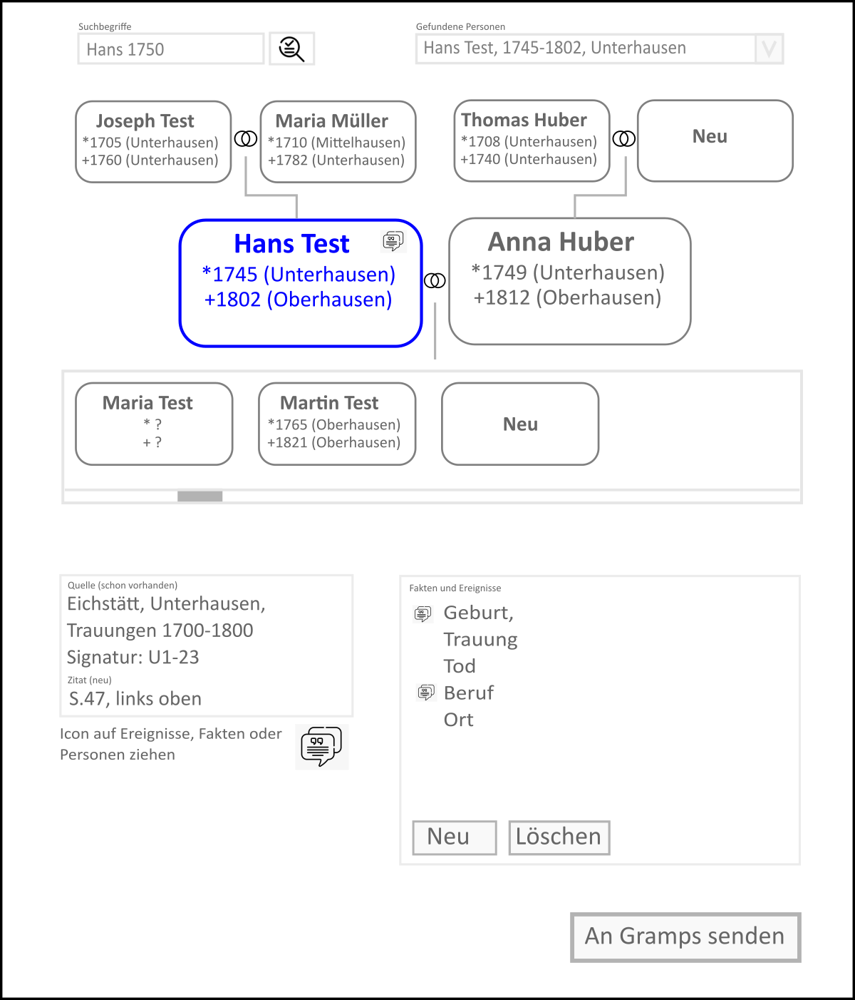

# MatrikelHelfer ↔ Gramps Bridge — Anforderungsdokument

**Version:** 0.3
**Datum:** 2026-08-16
**Status:** Stufe 0 (Schreib-Spike) am 2026-08-16 **bestanden** — Architektur bestätigt, Umsetzung der Stufen 1–7 kann beginnen

---

## 1. Zweck und Kontext

MatrikelHelfer ist eine C#/.NET-Anwendung zur Erfassung genealogischer Quellenzitate aus Digitalisaten von Kirchenbüchern (primär Matricula Online). Die erfassten Zitate sollen ohne manuellen Import-/Exportzyklus in eine laufende **Gramps Desktop**-Instanz übernommen und dort an bestehende Personen und Ereignisse angehängt werden.

Dieses Dokument beschreibt die dafür erforderliche Komponente: ein **Gramps-Addon (Python)**, das innerhalb des Gramps-Prozesses einen lokalen HTTP-Endpunkt bereitstellt, über den MatrikelHelfer den Stammbaum lesen und Quellen/Zitate schreiben kann.

**Ausblick weitere Backends (2026-08-20):** Gramps ist das *erste* angebundene Genealogieprogramm, nicht zwingend das einzige. Das Datenmodell des Clients (Person/Familie/Ereignis/Quelle/Zitat, Baumgraph, Änderungsliste) ist das GEDCOM-Modell und damit programmneutral; die Erweiterung erfolgt später wahlweise über (a) eine weitere Bridge, die **dasselbe HTTP-Protokoll** implementiert (z. B. als Plugin für erweiterbare Software), oder (b) einen clientseitigen Adapter hinter einer dann zu extrahierenden Backend-Schnittstelle. Dafür werden bei der Integration in MatrikelHelfer alle Bridge-Zugriffe in **einer** Adapterklasse gebündelt; die Schnittstelle selbst wird bewusst erst extrahiert, wenn ein zweites Backend konkret wird. Software ohne Schreib-API (Ancestry) bleibt außen vor (§2.2, Browser-Extension-Weg).

### 1.1 Warum diese Architektur

Untersuchte und verworfene Alternativen:

| Ansatz | Ausschlussgrund |
|---|---|
| gramps-webapi (REST-Server) | Erfordert eigenständigen Python-Stack mit PyGObject bzw. Docker/WSL; für Endanwender nicht zumutbar. Zweite Datenbankkopie mit Sync-Schritt. |
| Gramps-XML Import/Export | Gramps-Import führt **keine** Zusammenführung durch — überlappende Objekte werden dupliziert. Erfordert zusätzlich manuellen Export vor der Erfassung. |
| Direkter SQLite-Schreibzugriff | Lock-Konflikt mit laufendem Gramps; serialisierte Objektspeicherung; kein öffentlich garantiertes Schema. |
| Vollständige Neuimplementierung als Python-Addon | Aufgabe der bestehenden C#-Codebasis; UI-Automation für Browser-Erfassung in der Gramps-Python-Umgebung schwer realisierbar. |

Der gewählte Ansatz nutzt aus, dass ein Addon **im Gramps-Prozess** läuft: Die Datenbank ist bereits geöffnet, schreibbar und ohne Lock-Konflikt zugänglich; die Gramps-Laufzeitumgebung ist vorhanden; Änderungen erscheinen unmittelbar in der Oberfläche und im Undo-Stack.

### 1.2 Systemüberblick

```
┌──────────────────────────┐        HTTP/JSON        ┌────────────────────────────┐
│   MatrikelHelfer (C#)    │  ───────────────────▶   │   Gramps Desktop (Python)  │
│                          │      127.0.0.1:PORT     │                            │
│  - Browser-Erfassung     │  ◀───────────────────   │   ┌────────────────────┐   │
│  - Zitat-Aufbereitung    │                         │   │ MatrikelHelfer-    │   │
│  - Personenauswahl-UI    │                         │   │ Bridge (Addon)     │   │
└──────────────────────────┘                         │   └─────────┬──────────┘   │
                                                     │             │              │
                                                     │      Gramps DB-API         │
                                                     └────────────────────────────┘
```

Zwei getrennte Prozesse, gekoppelt über ein lokales HTTP/JSON-Protokoll. Keine In-Process-Kopplung, kein gemeinsamer Speicher, keine geteilten Bibliotheken.

---

## 2. Abgrenzung

### 2.1 In Scope

- Gramps-Addon mit lokalem HTTP-Server (Lesen und Schreiben)
- Endpunkt-Discovery und Authentifizierung zwischen beiden Prozessen
- Personen-/Ereignissuche für die Zuordnung in MatrikelHelfer
- Anlegen von Repositories, Quellen (Sources), Zitaten (Citations), Notizen
- Verknüpfen von Zitaten mit bestehenden Objekten (Person, Ereignis, Familie)
- Optionales Anlegen fehlender Ereignisse
- Gramplet-UI zur Statusanzeige und Steuerung des Servers

### 2.2 Out of Scope (spätere Ausbaustufen)

- Medienobjekte (Bildausschnitte der Digitalisate) — vorgesehen für v2
- ~~Bearbeiten oder Löschen bestehender Objekte über die Bridge~~ — **Revidiert 2026-08 (Feldtest):** Das ursprüngliche „nur ergänzen“-Prinzip wurde bewusst und ENG aufgeweicht, weil Korrekturen (Transkriptionsfehler, importierte Dubletten) genau WÄHREND der Kirchenbucharbeit auffallen. `POST /capture-batch` kann jetzt zusätzlich: bestehende **Personen** korrigieren (Vorname/erster Nachname/Geschlecht der Primärnamen — sparsam: nur übergebene Schlüssel, alles andere bleibt unberührt), bestehende **Ereignisse** korrigieren (Typ/Datum/Ort/Beschreibung) und **löschen** (mit vollständiger Rückverweis-Bereinigung wie Gramps’ eigenes Löschen), bestehende **Zitate** korrigieren (Fundstelle/Seite). Schutzmechanismen: `expect_change` (Änderungszeit beim Lesen; Abweichung → 409 CONFLICT, geprüft VOR den eigenen Commits des Stapels) und die Behandlung offener Gramps-Editoren (saubere Editoren werden geschlossen, ungespeicherte brechen mit 409 EDITOR_OPEN ab). Personen/Familien/Quellen bleiben **unlöschbar**; Bearbeitung von Quellen/Orten weiterhin out of scope.
- Ancestry-/RootsMagic-Publikationspipeline (eigenes Vorhaben)
- Ortsbereinigung / GOV-Hierarchie-Normalisierung (eigenes Vorhaben)
- Nicht-lokale Nutzung (Netzwerkzugriff von anderen Rechnern)
- macOS-/Linux-spezifische Besonderheiten der MatrikelHelfer-Seite (Addon selbst plattformneutral)

---

## 3. Randbedingungen

### 3.1 Laufzeitumgebung des Addons

| Aspekt | Vorgabe |
|---|---|
| Gramps-Zielversion | 6.0 und höher; bei API-Brüchen versionsspezifische Zweige |
| Python | Die von Gramps mitgelieferte Laufzeit (AIO unter Windows) |
| **Fremdpakete** | **Keine.** Ausschließlich Python-Standardbibliothek plus die von Gramps bereitgestellten Module (GTK/GLib über PyGObject). Kein `pip install` beim Anwender. |
| HTTP-Server | `http.server` aus der Standardbibliothek, in eigenem Thread |
| JSON | `json` aus der Standardbibliothek |
| Lizenz | MIT (GPL-kompatibel; siehe §11) |

Diese Einschränkung ist bindend: Die Installierbarkeit über den Addon-Manager ohne jeden Zusatzschritt ist das zentrale Argument für diese Architektur.

### 3.2 Gramps-spezifische Randbedingungen

- **Single-Threading:** Gramps ist GTK-basiert und nicht threadsicher. Jeder Datenbankzugriff — lesend wie schreibend — muss im GTK-Hauptthread erfolgen (siehe §6.2).
- **Transaktionen:** Schreibvorgänge ausschließlich über `DbTxn`, damit der Gramps-Undo-Mechanismus funktioniert.
- **Kein geöffneter Baum:** Der Server kann laufen, während kein Stammbaum geöffnet ist. In diesem Zustand liefern alle datenbezogenen Endpunkte einen definierten Fehler.
- **Baumwechsel:** Öffnet der Anwender einen anderen Stammbaum, muss die Bridge dies erkennen und in `/ping` melden (siehe §5.3).

---

## 4. Komponente A: Gramps-Addon „MatrikelHelfer Bridge"

### 4.1 Addon-Typ

Registrierung als **Gramplet** für die Personen-Ansicht (Sidebar/Bottombar), ergänzt um einen `General Plugin lib`-Anteil, falls der Server unabhängig von der Sichtbarkeit des Gramplets laufen soll.

> **Entwurfsentscheidung offen:** Startet der Server nur, wenn das Gramplet sichtbar ist, oder beim Laden des Addons? Empfehlung: Start beim Laden, Gramplet dient nur der Anzeige und Steuerung. Damit muss der Anwender das Gramplet nicht dauerhaft eingeblendet lassen.

### 4.2 Funktionale Anforderungen

**FA-1 — Serverlebenszyklus**
Der HTTP-Server startet in einem Hintergrund-Thread, gebunden ausschließlich an `127.0.0.1`. Beim Beenden von Gramps wird er sauber heruntergefahren.

**FA-2 — Portwahl**
Standardport konfigurierbar (Vorgabe z. B. 8791). Ist der Port belegt, wird der nächste freie Port im Bereich +0…+19 verwendet. Der tatsächlich verwendete Port wird über die Discovery-Datei bekanntgegeben (FA-3).

**FA-3 — Discovery-Datei**
Beim Start schreibt das Addon eine Datei in das Gramps-Benutzerverzeichnis:

```
<GRAMPS_USER_DIR>/matrikelhelfer/endpoint.json
```

Inhalt:

```json
{
  "api_version": 1,
  "port": 8791,
  "token": "<32 Byte, hex>",
  "pid": 12345,
  "tree_name": "Meine Ahnen",
  "gramps_version": "6.0.1",
  "addon_version": "0.1.0",
  "started": "2026-08-16T10:22:31Z"
}
```

Die Datei wird beim Beenden gelöscht. Dateirechte, soweit plattformseitig möglich, auf den aktuellen Benutzer beschränken.

**FA-4 — Token**
Bei jedem Serverstart wird ein neues Zufallstoken (`secrets.token_hex(32)`) erzeugt. Jede Anfrage außer `/ping` muss es im Header `X-MatrikelHelfer-Token` mitführen. Fehlt oder differiert es → HTTP 401.

**FA-5 — Gramplet-Oberfläche**
Anzeige von: Serverstatus (läuft/gestoppt), Port, Name des geöffneten Stammbaums, Zeitpunkt und Art der letzten Anfrage, Zähler der in dieser Sitzung angelegten Objekte. Bedienelemente: Start/Stopp, Token neu erzeugen, Port ändern.

**FA-6 — Protokollierung**
Fehler über das Gramps-Logging (`logging.getLogger("MatrikelHelferBridge")`). Zusätzlich ein Ringpuffer der letzten ~50 Anfragen zur Anzeige im Gramplet.

**FA-7 — Idempotenz**
Jede schreibende Anfrage kann eine `request_id` (UUID) mitführen. Wird dieselbe `request_id` innerhalb der Sitzung erneut gesendet, wird die ursprüngliche Antwort zurückgegeben, ohne erneut zu schreiben. Schützt vor Doppelanlage bei Netzwerk-Timeouts oder Wiederholungen durch den Client.

---

## 5. API-Spezifikation

Basis-URL: `http://127.0.0.1:<port>/api/v1`
Content-Type: `application/json; charset=utf-8`
Authentifizierung: Header `X-MatrikelHelfer-Token`

### 5.1 Fehlermodell

Einheitlich für alle Endpunkte:

```json
{
  "error": {
    "code": "NO_TREE_OPEN",
    "message": "Es ist kein Stammbaum geöffnet.",
    "detail": null
  }
}
```

| HTTP | Code | Bedeutung |
|---|---|---|
| 400 | `INVALID_REQUEST` | Fehlerhafte oder unvollständige Nutzdaten |
| 401 | `UNAUTHORIZED` | Token fehlt oder ungültig |
| 404 | `NOT_FOUND` | Referenziertes Handle existiert nicht |
| 409 | `NO_TREE_OPEN` | Kein Stammbaum geöffnet |
| 409 | `TREE_CHANGED` | Baum wurde seit Sitzungsbeginn gewechselt |
| 500 | `INTERNAL_ERROR` | Unerwarteter Fehler; Detail im Log |
| 504 | `MAIN_THREAD_TIMEOUT` | Operation im Hauptthread nicht innerhalb des Zeitlimits abgeschlossen |

### 5.2 Konventionen

- **Handles** sind die stabilen internen Gramps-Kennungen und der primäre Referenzschlüssel im Protokoll.
- **Gramps-IDs** (`I0042`, `E0011`) werden zusätzlich ausgeliefert, sind aber nicht als Schlüssel zu verwenden.
- **Datumsangaben** werden in einer strukturierten Form übertragen (siehe §5.9), nicht als freier Text.
- Alle Textfelder sind UTF-8.

### 5.3 `GET /ping`

Ohne Token aufrufbar (dient dem Verbindungstest).

```json
{
  "api_version": 1,
  "addon_version": "0.1.0",
  "gramps_version": "6.0.1",
  "tree_open": true,
  "tree_name": "Meine Ahnen",
  "tree_id": "<db-id>",
  "session_id": "<uuid, neu bei jedem Baumwechsel>"
}
```

`session_id` erlaubt dem Client, einen Baumwechsel zu erkennen und zwischengespeicherte Handles zu verwerfen.

### 5.4 `GET /persons`

Personensuche für die Zuordnung.

Parameter:

| Name | Typ | Bedeutung |
|---|---|---|
| `q` | string | Suchbegriff über Nachname, Vorname, Rufname |
| `surname` | string | Gezielte Nachnamensuche |
| `given` | string | Gezielte Vornamensuche |
| `birth_year_from`, `birth_year_to` | int | Eingrenzung über Geburtsjahr |
| `place` | string | Eingrenzung über Ortsname (beliebige Ereignisse) |
| `limit` | int | Vorgabe 50, Maximum 500 |
| `offset` | int | Vorgabe 0 |

Antwort:

```json
{
  "total": 3,
  "results": [
    {
      "handle": "a1b2c3...",
      "gramps_id": "I0042",
      "primary_name": "Hans Test",
      "surname": "Test",
      "given": "Hans",
      "call_name": null,
      "gender": "M",
      "birth": { "date_text": "12.03.1780", "sort_year": 1780, "place": "Gaden, Waging, Traunstein, Bayern" },
      "death": { "date_text": "1841", "sort_year": 1841, "place": "Waging" },
      "parents": [ { "handle": "...", "primary_name": "Georg Test" } ]
    }
  ]
}
```

Die Eltern werden mitgeliefert, weil sie bei gleichnamigen Personen das entscheidende Unterscheidungsmerkmal sind.

### 5.5 `GET /persons/{handle}`

Vollständigere Sicht für die Detailanzeige im Client: alle Namen, Ereignisse mit Typ/Datum/Ort/Rolle, Eltern, Ehepartner, Kinder, bereits vorhandene Zitate je Ereignis.

Der Rückgabewert enthält je Ereignis ausdrücklich `citation_count`, damit MatrikelHelfer erkennen kann, ob ein Beleg bereits vorhanden ist.

Die Ereignisliste umfasst neben den **Personenereignissen** auch die **Familienereignisse** der Familien, in denen die Person Partner ist (Trauung, Scheidung …) — in Gramps hängen diese am Familienobjekt, nicht an der Person. Jedes Ereignis trägt `scope` (`person` | `family`) und bei Familienereignissen `family_handle`. (Erkenntnis aus dem Sandbox-Test 2026-08-17: ohne dies kann der Client eine vorhandene Trauung weder anzeigen noch als Ziel wählen.)

### 5.6 `GET /sources` und `GET /repositories`

Suche über Titel bzw. Name, gleiche Parameterlogik wie `/persons` (`q`, `limit`, `offset`).

Zweck: MatrikelHelfer soll vor dem Anlegen einer neuen Quelle prüfen, ob das Kirchenbuch bereits erfasst ist, um Dubletten zu vermeiden.

Zusätzlich empfohlen: `GET /sources?attribute_key=MH_SourceKey&attribute_value=<key>` für die gezielte Wiedererkennung über einen von MatrikelHelfer vergebenen Schlüssel (siehe §7.2).

### 5.6a `GET /event-types`

Liefert den strukturierten Ereignistyp-Katalog des Gramps-Ereigniseditors (2026-08-18, für die Ereignis-Auswahl im Gramps-Modus — ersetzt die zuvor im Client fest codierte Liste):

```json
{
  "groups": [
    { "name": "Lebensereignisse", "types": [
        { "xml": "Birth", "label": "Geburt", "is_family": false }, …
    ]}, …
  ],
  "custom": ["<im Baum verwendete eigene Typen>"]
}
```

`xml` ist der lokalisierungsunabhängige Name, den `POST /capture` über `set_from_xml_str()` interpretiert; `label` die Anzeige in der Gramps-Sprache. `is_family` spiegelt die Zugehörigkeit zur Gruppe „Familie“ — diese Ereignisse gehören an das Familienobjekt (§5.7). Eigene Typen des Baums werden zusätzlich geliefert und unverändert durchgereicht (unbekannte Namen werden in Gramps automatisch Custom-Typen).

### 5.7 `POST /capture` — zentraler Schreibendpunkt

Führt die gesamte Erfassung **in einer einzigen Gramps-Transaktion** aus. Das ist der wichtigste Endpunkt; Einzeloperationen (§5.8) sind nachrangig.

```json
{
  "request_id": "9f1c...",
  "repository": {
    "match": { "by": "name", "value": "Matricula Online" },
    "create_if_missing": {
      "name": "Matricula Online",
      "type": "Website",
      "url": "https://data.matricula-online.eu/"
    }
  },
  "source": {
    "match": { "by": "attribute", "key": "MH_SourceKey", "value": "de-pollenfeld-taufen-003" },
    "create_if_missing": {
      "title": "Pollenfeld, Taufbuch Bd. 3 (1720–1780)",
      "author": "Kath. Pfarramt Pollenfeld",
      "publication_info": "Bistumsarchiv Eichstätt",
      "attributes": [ { "key": "MH_SourceKey", "value": "de-pollenfeld-taufen-003" } ],
      "repository_ref": { "call_number": "BAE 12/3", "media_type": "Book" }
    }
  },
  "citation": {
    "page": "S. 142, Eintrag 7",
    "date": { "type": "regular", "year": 1780, "month": 3, "day": 12, "calendar": "gregorian" },
    "confidence": "normal",
    "attributes": [
      { "key": "Digitalisat", "value": "https://data.matricula-online.eu/de/..." },
      { "key": "MH_CapturedAt", "value": "2026-08-16T10:24:00Z" }
    ],
    "notes": [
      { "type": "Citation", "text": "Transkription: Joannes, ehel. Sohn des ..." }
    ],
    "urls": [
      { "path": "https://data.matricula-online.eu/de/...", "description": "Digitalisat", "type": "Web Link" }
    ]
  },
  "targets": [
    { "type": "event", "handle": "e5f6..." }
  ],
  "create_event_if_missing": {
    "person_handle": "a1b2c3...",
    "event_type": "Baptism",
    "role": "Primary",
    "date": { "type": "regular", "year": 1780, "month": 3, "day": 12 },
    "place_handle": null,
    "description": "Taufe laut Matrikel Pollenfeld"
  }
}
```

**Verarbeitungsregeln:**

1. Prüfen, ob `request_id` bereits verarbeitet wurde → ggf. gespeicherte Antwort zurückgeben.
2. Repository suchen; falls nicht vorhanden und `create_if_missing` gesetzt → anlegen.
3. Quelle suchen (bevorzugt über Attribut, sonst über Titel); falls nicht vorhanden → anlegen und mit Repository verknüpfen.
4. Zitat anlegen und mit der Quelle verknüpfen.
5. Sind `targets` angegeben → Zitat an alle genannten Objekte anhängen.
6. Ist `create_event_if_missing` gesetzt → Ereignis anlegen, dem Träger zuordnen, Zitat daran hängen. **Kombinierbar mit `targets`** (dasselbe Zitat hängt dann an bestehenden Objekten *und* am neuen Ereignis — ein Kirchenbucheintrag belegt oft mehrere Fakten gleichzeitig, vgl. §7.3). Träger ist **genau eines** von `person_handle` (Personenereignis, Rollen-Vorgabe `Primary`) oder `family_handle` (Familienereignis wie Trauung, Rollen-Vorgabe `Family`) — Trauungen gehören in Gramps an die Familie, nicht an die Person (Sandbox-Erkenntnis 2026-08-17).
7. Optionaler Block `person_url` (`{path, description, type}`, Typ-Vorgabe `Digitalisat`): Der Permalink wird zusätzlich als klickbarer Eintrag in den **Internet-Reiter der beteiligten Personen** kopiert — nur Person und Repository haben in Gramps eine klickbare URL-Liste; das Zitat-Attribut `Digitalisat` (bis 2026-08 `MH_Permalink` — wird weiterhin gelesen; `MH_SourceKey` behält seinen Namen bewusst, es ist der maschinelle Wiedererkennungs-Schlüssel) ist es nicht (Sandbox-Erkenntnis 2026-08-17). Beteiligte Personen: Ziel-Personen direkt, bei Ziel-Familien und Familienereignissen beide Partner, bei Ziel-Ereignissen die per Rückverweis ermittelten Träger. Dedupliziert über den Pfad — derselbe Link wird nie doppelt angelegt; alles in derselben Transaktion.
7. Alles innerhalb **einer** `DbTxn` mit sprechendem Namen, z. B. `"MatrikelHelfer: Zitat Pollenfeld Bd. 3 S. 142"`. Bei einem Fehler in Schritt 2–6 wird die gesamte Transaktion verworfen.

**Antwort:**

```json
{
  "request_id": "9f1c...",
  "created": {
    "repository": { "handle": "...", "gramps_id": "R0003", "was_existing": true },
    "source":     { "handle": "...", "gramps_id": "S0021", "was_existing": false },
    "citation":   { "handle": "...", "gramps_id": "C0198", "was_existing": false },
    "event":      { "handle": "...", "gramps_id": "E0311", "was_existing": false },
    "notes":      [ { "handle": "...", "gramps_id": "N0044" } ]
  },
  "attached_to": [ { "type": "event", "handle": "e5f6...", "gramps_id": "E0311" } ],
  "transaction_label": "MatrikelHelfer: Zitat Pollenfeld Bd. 3 S. 142"
}
```

### 5.7b `POST /capture-batch` — Sitzungs-Upload in einer Transaktion

Umgesetzt 2026-08-19 (Addon 0.13.0), nachdem die klientseitige Abhängigkeitsauflösung (Fixpunkt über Personen-Captures) sich als fehleranfällig erwiesen hatte: Der gesamte Upload einer Gramps-Modus-Sitzung läuft in **einer** `DbTxn` — alles oder nichts, **ein einziges Undo** verwirft die komplette Sitzung (löst das gleichnamige Vorhaben aus §7.3 ein).

```json
{
  "request_id": "…",
  "persons":  [ { "tmp": "new:p1", "given": "…", "surname": "…", "gender": "F" } ],
  "families": [ { "tmp": "new:f1", "father": "<handle|tmp>", "mother": "…", "children": ["…"] },
                { "handle": "<bestehende Familie>", "children": ["new:p3"] } ],
  "events":   [ { "tmp": "evt:e1", "type": "Marriage", "family": "new:f1", "date": { … } } ],
  "citations": [ { "repository": { … }, "source": { … }, "citation": { … },
                   "targets": [ { "type": "event", "ref": "evt:e1" } ],
                   "person_url": { … } } ],
  "attach":   [ { "citation": "<handle>", "targets": [ … ] } ]
}
```

Verarbeitung in fester, immer auflösbarer Reihenfolge: nackte Personen → Familienverknüpfungen (neue Familien bzw. **nur ergänzende** Mitglieder bestehender Familien; belegte Partner-Slots → 400) → Ereignisse → Zitate (Repo/Quelle match-or-create, innerhalb des Stapels gecacht: mehrere Zitate desselben Buchs teilen **eine** Quelle) → Anhängen vorhandener Zitate. Referenzen sind wahlweise echte Handles oder vom Client gewählte temporäre IDs; die Antwort liefert die Zuordnung `tmp → handle` je Objektart. Idempotent über `request_id`. Die Zwischenzustände (unverknüpfte Personen) sind nie beobachtbar — bei jedem Fehler bricht die Transaktion vollständig ab.

Der Client wird damit trivial: Änderungsliste + virtueller Teilgraph werden serialisiert und in einem Aufruf gesendet; sämtliche klientseitige Reihenfolge-/Verknüpfungslogik entfällt. `POST /capture` bleibt für Einzel-Erfassungen bestehen.

### 5.8 Einzeloperationen (nachrangige Priorität)

Für Sonderfälle und Werkzeugcharakter, jeweils in eigener Transaktion:

| Methode | Pfad | Zweck |
|---|---|---|
| `POST` | `/repositories` | Repository anlegen |
| `POST` | `/sources` | Quelle anlegen |
| `POST` | `/citations` | Zitat anlegen (ohne Verknüpfung) |
| `POST` | `/citations/{handle}/attach` | Vorhandenes Zitat an Objekt hängen |
| `POST` | `/events` | Ereignis anlegen und Person zuordnen |
| `POST` | `/notes` | Notiz anlegen |

### 5.9 Datumsformat

```json
{
  "type": "regular" | "range" | "span" | "about" | "before" | "after" | "textonly",
  "year": 1780, "month": 3, "day": 12,
  "year_end": null, "month_end": null, "day_end": null,
  "calendar": "gregorian" | "julian",
  "quality": "none" | "estimated" | "calculated",
  "text": null
}
```

Bei `textonly` wird ausschließlich `text` ausgewertet. Kirchenbucheinträge vor 1583 bzw. aus julianisch geführten Sprengeln erfordern die Kalenderangabe — sie darf nicht stillschweigend auf gregorianisch gesetzt werden.

---

## 6. Nichtfunktionale Anforderungen

### 6.1 Sicherheit

**NFA-1** Bindung ausschließlich an `127.0.0.1`, niemals `0.0.0.0`.

**NFA-2** Token-Pflicht für alle Endpunkte außer `/ping`.

**NFA-3** **Schutz vor Zugriffen aus dem Browser.** Da der Anwender parallel Matricula im Browser geöffnet hat, könnte eine beliebige Webseite per JavaScript Anfragen an `localhost` senden. Erforderlich:

- Keine CORS-Header ausliefern (verhindert das Auslesen von Antworten durch Fremdseiten)
- Anfragen mit `Origin`-Header ablehnen, sofern dieser nicht leer bzw. nicht erwartet ist
- Ausschließlich `Content-Type: application/json` akzeptieren (verhindert einfache Formular-POSTs)
- Das Token liegt in einer Datei, die eine Webseite nicht lesen kann — es ist die eigentliche Schutzschicht

**NFA-4** Keine Ausgabe von Dateipfaden oder Stacktraces in HTTP-Antworten; Details ausschließlich ins lokale Log.

### 6.2 Thread-Sicherheit (kritisch)

Der HTTP-Handler läuft in einem Worker-Thread; die Gramps-Datenbank darf nur aus dem GTK-Hauptthread heraus angesprochen werden.

Vorgehen:

1. Der Handler-Thread stellt eine Aufgabe (Callable) in eine Warteschlange und legt ein `threading.Event` an.
2. Ausführung im Hauptthread über `GLib.idle_add()`.
3. Der Hauptthread führt die Aufgabe aus, legt Ergebnis oder Ausnahme ab und setzt das Event.
4. Der Handler-Thread wartet mit Zeitlimit (Vorgabe 30 s, konfigurierbar) und antwortet.
5. Zeitüberschreitung → HTTP 504 `MAIN_THREAD_TIMEOUT`.

Diese Marshalling-Schicht ist **einmal zentral** zu implementieren; kein Endpunkt darf die Datenbank direkt aus dem Worker-Thread ansprechen. Verstöße hiergegen erzeugen sporadische, schwer reproduzierbare Abstürze.

### 6.3 Robustheit

- Kein Zustand außerhalb der Gramps-Datenbank persistieren (Ausnahme: Discovery-Datei und der flüchtige Idempotenz-Cache).
- Ausnahmen im Server-Thread dürfen Gramps nie zum Absturz bringen: oberste Handler-Ebene fängt alles ab.
- Bei Baumwechsel oder Schließen des Baums: Server läuft weiter, `session_id` ändert sich, datenbezogene Endpunkte liefern `NO_TREE_OPEN`.

### 6.4 Leistung

- Personensuche über 20.000 Personen: Antwortzeit unter 1 s. Realisierung: In-Memory-Namensindex (Namen, Geburts-/Sterbedaten, Ereignisorte), aufgebaut beim ersten Suchzugriff nach Baumwechsel, verworfen bei jeder Objektänderung (DB-Signale `person/family/event/place-add/update/delete/rebuild`). Der einmalige Indexaufbau darf spürbar dauern; die Dauer wird protokolliert.
- `POST /capture`: unter 500 ms bei geöffnetem Baum.
- Der Server darf im Leerlauf keine spürbare CPU-Last erzeugen.

---

## 7. Komponente B: MatrikelHelfer-Seite

### 7.1 Verbindungsaufbau

**FA-C1** Beim Start Discovery-Datei an der bekannten Stelle lesen. Windows: `%APPDATA%\gramps\matrikelhelfer\endpoint.json`. Pfad überschreibbar per Einstellung.

**FA-C2** `GET /ping` zur Prüfung. Antwortet der Endpunkt nicht oder stimmt die `pid` nicht mit einem laufenden Prozess überein → Datei als verwaist behandeln und dem Anwender melden: „Gramps ist nicht erreichbar. Bitte Gramps starten und einen Stammbaum öffnen."

**FA-C3** `api_version` prüfen. Bei Abweichung Warnung mit Versionsangaben statt stiller Fehlfunktion.

**FA-C4** `session_id` speichern. Ändert sie sich, alle zwischengespeicherten Handles verwerfen und die Personenauswahl zurücksetzen.

**FA-C5** MatrikelHelfer darf **niemals** annehmen, dass ein zwischengespeichertes Handle noch gültig ist. Vor jedem Schreibvorgang ist das Zielobjekt erneut abzurufen; liefert dies 404, muss die Zuordnung neu erfolgen (der Anwender könnte das Objekt in Gramps zwischenzeitlich gelöscht oder zusammengeführt haben).

### 7.2 Quellen-Wiedererkennung

MatrikelHelfer vergibt je Kirchenbuchband einen stabilen, deterministischen Schlüssel (`MH_SourceKey`), abgeleitet aus Pfarrei, Buchtyp und Bandbezeichnung — z. B. `de-pollenfeld-taufen-003`. Dieser wird als Attribut an der Gramps-Quelle abgelegt und dient bei Folgeerfassungen der Wiedererkennung, ohne auf Titelvergleiche angewiesen zu sein.

Analog kann ein `MH_CitationKey` (abgeleitet aus Quellschlüssel plus Seite/Eintrag) das versehentliche doppelte Erfassen desselben Eintrags erkennbar machen. Der Client sollte in diesem Fall warnen statt stillschweigend erneut anzulegen.

**FA-C6 — Quellen-Vorschau vor der Erfassung** (Erkenntnis aus dem Sandbox-Test 2026-08-17): Vor `POST /capture` fragt der Client die Quelle per `GET /sources?attribute_key=MH_SourceKey&…` ab. Existiert sie bereits und weicht ihr Titel vom aktuell erfassten Buch ab, wird gewarnt (Zitat würde an die *bestehende* Quelle gehängt; `create_if_missing` wird bei Attribut-Treffer ignoriert). Die Capture-Antwort liefert dazu im Quellen-Ergebnis zusätzlich `title`, damit der Client nach der Erfassung anzeigen kann, an welcher Quelle das Zitat wirklich hängt. Der Auslöser bleibt bewusst der Titel allein — beschreibende Felder (Autor, Publikationsangabe) dürfen nach der Anlage in Gramps weitergepflegt werden, ohne Warnungen auszulösen (Gramps ist nach der Anlage Master der Quellenbeschreibung). Vom Anwender bestätigte Schlüssel↔Titel-Paare sollen gemerkt werden (mindestens je Sitzung), damit eine bewusste Umbenennung in Gramps nicht bei jeder Erfassung erneut nachfragt.

### 7.3 Gramps-Modus: UI-Konzept (Stand der Diskussion 2026-08-17)

**Umsetzungsstand 2026-08-20: Der Gramps-Modus ist in MatrikelHelfer selbst umgesetzt** — als eigener Reiter „Gramps“ neben „Zitate“ (nicht mehr als Ersatz des Speichern-Flyouts; das Hauptfenster wurde auf Reiter umgestellt). Funde liegen in der gemeinsamen **„Ablage“** (Kartenliste rechts, beide Reiter) und werden per Ziehen/Doppelklick der zentrierten Person zugeordnet; Änderungslisten-Einträge referenzieren den gespeicherten Fund per ID, die Zitat-Daten werden beim Upload aus dem aktuellen Fund-Stand aufgebaut. Der Reiter ist eine feste ~500px-Spalte (Suche / Baum / Zuordnungsansicht 75 % / Änderungsliste 25 %), Boxen kompakt mit intelligenter Namenskürzung. Der `GrampsBridgeTester` bleibt eingefroren als Bridge-/API-Testwerkzeug. Ursprüngliches Konzept:



**Navigation („begehbarer Baum")**
Suchfeld (Name + ungefähres Jahr) → Trefferliste → gewählte Person erscheint als Zentrum eines Mini-Stammbaums: Eltern darüber, Partner daneben (mit dessen Eltern), Kinder darunter. **Klick auf eine beliebige Personenbox zentriert den Baum auf diese Person** — der Anwender wandert durch den Baum wie in einer Genealogie-Anwendung (typischer Ablauf: Trauung erfasst → Vater im Eintrag erwähnt → dessen Sterbeeintrag in Matricula gesucht → Vater angeklickt → Fund zugeordnet). Daten je Sprung: ein `GET /persons/{handle}` (plus eines für die Eltern des Partners). Lesender Zugriff; die Suche bleibt als Absprung erhalten.

**Gestaltungsregeln aus dem Prototyp (2026-08-17):** Feste Positionen im Paar — **Mann links, Frau rechts**; die Auswahl wechselt nur den blauen Rahmen, nie die Plätze (auch die Elternpaare bleiben über ihrem jeweiligen Partner). Der Baum hat ein **stabiles Skelett**: fehlende Personen erscheinen als inaktive „Neu"-Boxen (2 Eltern je Seite, Partner, ein Kind-Slot), damit beim Navigieren nichts springt. Boxen haben **feste Breiten** (Paar-Boxen 1,5-fach), Inhalte kompakt: nur Jahreszahl und unterste Ortsebene („* 1745 Unterhausen"), Überlauf mit Ellipse, vollständige Angaben im Tooltip. Eltern innenbündig über dem Paar ausgerichtet (rechte Kante der Mutter = rechte Kante des Bräutigams, gespiegelt für die Braut), Kinderzeile in Breite der Elternzeile mit eigenem Scrollbalken. **Klick irgendwo auf eine Box navigiert**; die Familienauswahl erscheint nur bei mehreren Ehen. Gesamtbreite auf das rechte Panel von MatrikelHelfer ausgelegt.

**Zuordnungsansicht statt Drag & Drop** (Umbau nach Prototyp-Erfahrung, 2026-08-18)
Die Zuordnung von Zitaten erfolgt über eine Ancestry-inspirierte Verknüpfungsansicht: links die Ereignisliste der Person, rechts Karten für den aktuellen Fund („Neuer Fund“) und alle vorhandenen Zitate der Person (Beschriftung: Quellen-**Abkürzung** + Seite, vollständige Angaben im Tooltip; die Abkürzung wird beim Anlegen fest abgeleitet — „Pfarrei, Buchtyp Von–Bis“ —, eine Konfigurierbarkeit kann später folgen). Klick auf eine Seite zeichnet Verbindungslinien zu den Gegenstücken (durchgezogen = in Gramps vorhanden, gestrichelt = in der Änderungsliste vorgemerkt). **Doppelklick** versetzt ein Element in den Zuordnungsmodus: Klicks auf die Gegenseite schalten Verknüpfungen um und erzeugen bzw. entfernen Änderungslisten-Einträge. Bestehende Gramps-Verknüpfungen sind dabei gesperrt (kein Lösen über die Bridge, §2.2); vorhandene Zitate können jedoch weiteren Ereignissen zugeordnet werden (`POST /citations/{handle}/attach`, §5.8 — erster umgesetzter Einzelendpunkt). *Vorgemerkt für die Umsetzung in der App (nicht mehr im Tester): die Ereignisliste erhält dasselbe Kartendesign wie die Quellenspalte rechts — visuelle Verfeinerung erfolgt generell erst in der App (MahApps-Styling), der Tester bleibt beim Funktionsprototyp.*

**Entscheidung — keine Zitate direkt am Personenobjekt** (2026-08-18)
Die Verknüpfungsansicht bietet das Personenobjekt nicht als Zuordnungsziel an: Es gibt keinen genealogischen Anwendungsfall, in dem ein Kirchenbucheintrag die Person selbst statt eines ihrer Ereignisse belegt — belegt wird immer ein Faktum. Die Bridge-API behält `person` als Zieltyp (generisch, testabgedeckt), der Client nutzt ihn nicht. Der Permalink im Internet-Reiter der Person (`person_url`, §5.7) ist davon unberührt.

**Änderungsliste statt Zwei-Schritt-Staging** (Umbau nach Prototyp-Erfahrung, 2026-08-18)
Jede Nutzeraktion — Zitat einem Ereignis zugeordnet, Ereignis vorgemerkt, später: Person angelegt — erzeugt **sofort** einen Eintrag in einer lokalen **Änderungsliste**; einen separaten „Merken"-Schritt gibt es nicht. Einträge frieren den Fund-Datenstand zum Aktionszeitpunkt ein (im echten Client: Verweis auf den gespeicherten Fund, persistiert in `library.json`). Doppelte Ablage (gleicher Fund, gleiches Ziel) wird mit Hinweis ignoriert. Die Liste wird **als Baum** angezeigt: Wurzeln sind die betroffenen Personen/Familien, darunter die Operationen, abhängige Operationen verschachtelt — die Abhängigkeitsstruktur *ist* die Anzeige. **Löschen eines Eintrags macht die Aktion rückgängig** (auch in der Baumanzeige: Markierungen und „(neu)"-Zeilen verschwinden) und kaskadiert nach Rückfrage über abhängige Einträge; Löschen einer Wurzel entfernt alle Änderungen der Entität. Vorgemerkte neue Ereignisse erscheinen sofort als „(neu)"-Zeile in der Faktenliste und sind selbst Ablageziele.

**Upload („An Gramps senden")**
Der Upload führt die Änderungsliste aus: erzeugende Einträge zuerst, dann Zitat-Anhänge, wobei Einträge **desselben Fundes zu einem Capture mit gemeinsamem Zitat zusammengefasst** werden (ein Zitatobjekt, mehrfach referenziert — das GEDCOM-/Gramps-Modell); Verweise auf vorgemerkte Ereignisse werden über die zurückgemeldeten Handles aufgelöst. **Erfolgreiche Einträge verlassen die Liste ersatzlos** — nach dem Rücklesen ist Gramps die sichtbare Wahrheit, ein „hochgeladen"-Status ist überflüssig (Dublettenschutz leistet im echten Client der Upload-Vermerk am Fund). Fehlgeschlagene Einträge bleiben rot markiert und erneut ausführbar. **Umgesetzt (2026-08-19):** Der Upload läuft über den Batch-Endpunkt (§5.7b) — der gesamte Stapel in *einer* Gramps-Transaktion, alles oder nichts, ein einziges Undo verwirft die ganze Sitzung; bei einem Fehler bleibt die komplette Liste stehen (nichts wurde geschrieben) und trägt die Fehlermeldung.

**Rücklesen nach dem Upload, ohne Sichtsprung**
Nach dem Upload liest der Client den angezeigten Ausschnitt **vollständig neu** aus Gramps (Detail-Refetch der dargestellten Personen), damit die Anzeige garantiert dem tatsächlichen Gramps-Stand entspricht — einschließlich Änderungen, die der Anwender zwischenzeitlich direkt in Gramps gemacht hat. Da typischerweise *während* der Arbeit gespeichert wird, darf sich der **sichtbare Zustand des Baums dabei nicht ändern**: Zentrum, Layout und Scrollpositionen bleiben erhalten; die frischen Daten fließen in die bestehenden Boxen ein (Aktualisierung statt Neuaufbau — Boxen sind über Handle bzw. temporäre ID identifiziert). Ausstehende Markierungen wechseln **an Ort und Stelle** in den Zustand „hochgeladen"; virtuelle Personen werden nahtlos durch die real angelegten ersetzt (temporäre ID → Handle), ohne dass sich ihre Box bewegt.

**Folge-Effekte des Staging-Modells**
- **Dublettenschutz löst sich lokal:** Da Funde ihren Upload-Status (inkl. Gramps-IDs) tragen, weiß der Client, was bereits in Gramps ist — `MH_CitationKey`-Prüfungen und URL-Dedup-Heuristiken (vgl. §10.8) werden voraussichtlich überflüssig.
- **Offline-Modus (§7.3 alt) wird derselbe Mechanismus:** Die Queue füllt sich auch ohne erreichbare Bridge; der Upload erfolgt, sobald Gramps läuft.

**Personen-Anlage (v2, fest eingeplant — Kernworkflow)**
Kirchenbuch-Durchsicht erzeugt typischerweise Serien von Funden zu **noch nicht erfassten Personen** (z. B. Geschwisterreihen im Taufbuch). Der Umweg „in Gramps Person anlegen → zurück → zuordnen" ist nicht zumutbar. Konzept:
- „Neu"-Boxen im Baum erzeugen eine **virtuelle Person** (lokaler Stub mit temporärer ID; Name/Geschlecht/Daten aus dem Fund vorbelegt). Virtuelle Personen erscheinen im Baum wie echte und können sofort (auch mehrfach) Zuordnungen erhalten.
- Beim Upload wird die Abhängigkeitsreihenfolge aufgelöst: zuerst ein Capture mit `create_person`-Block (Person + Familienverknüpfung als Kind/Partner + Ereignis + Zitat in einer Transaktion), danach ersetzen die zurückgemeldeten Handles die temporären IDs in Folge-Zuordnungen.
- Bridge-Erweiterung: `create_person` in `POST /capture` (Name, Geschlecht, `child_of_family` bzw. `spouse_of`), Antwort enthält `created.person`. Die Bausteine (Person/Name/ChildRef/Family-Commit) sind durch die Testsuite bereits erprobt; v1 der Oberfläche zeigt „Neu"-Boxen deaktiviert.

**Umsetzungsstand Personen-Anlage (2026-08-19, Addon 0.11.0 + Tester):** umgesetzt, mit folgenden Präzisierungen gegenüber dem Konzept:
- `create_person` in `POST /capture`: `given`/`surname` (mind. eines), `gender` (M/F/U) und **genau eine** Verknüpfung — `child_of_family`; `child_of_person` (einzelner bekannter Elternteil, Familie wird miterzeugt); `spouse_of` (+ optional `family_handle`, um eine partnerlose Familie aufzufüllen statt eine neue zu gründen); `parent_of` (nutzt die bestehende Elternfamilie des Kindes oder erzeugt eine, Vater-/Mutter-Slot nach Geschlecht, belegter Slot → 400). Antwort: `created.person`, bei miterzeugter Familie `created.family`.
- `create_event_if_missing` darf `person_handle: "@new"` bzw. `family_handle: "@new"` referenzieren — das in derselben Erfassung erzeugte Objekt.
- Der `citation`-Block ist seither **optional** (nur sinnvoll für reine Personen-/Ereignisanlage; `targets` erfordern weiterhin ein Zitat, ein Ereignis ohne Zitatblock wird unbelegt angelegt).
- Tester-UI: Klick auf eine „Neu"-Box → Namensdialog (Geschlecht und Nachname nach Slot vorbelegt: Vater-Slot männlich mit Nachname der Bezugsperson, Partner-Slot gegengeschlechtlich, Kind unbestimmt) → die virtuelle Person erscheint an Ort und Stelle im Baum (blau, „(neu)“) und als eigene Wurzel in der Änderungsliste. **Ereignisdatum ≠ Eintragsdatum (2026-08-19):** Der Ereignisdialog erfragt das Datum des *Ereignisses* selbst — vorbelegt mit dem Datum des offenen Eintrags (richtig für das Primärereignis, die Taufe aus dem Taufbuch), aber frei änderbar samt Gramps-Qualifizierern (genau/um/vor/nach). Der Normalfall abgeleiteter Erwähnungen braucht das: „Mutter der Braut bereits verstorben“ im Trauungseintrag 1757 wird ein Sterbeereignis „vor 1757“, nicht ein Tod am Hochzeitstag; ein Taufeintrag nennt oft zusätzlich das Geburtsdatum — Taufe und Geburt sind dann **zwei Ereignisse mit verschiedenen Daten aus einem Eintrag**, die beim Upload dasselbe (eine) Zitat teilen. Das Eintragsdatum bleibt unverändert das Datum des **Zitats**. **Klick auf die virtuelle Box zentriert sie** — exakt dieselbe Geste und derselbe Codepfad wie bei echten Personen.

**Lokaler Personen-/Familiengraph (Umbau 2026-08-19):** Grundlage des Baums ist ein lokaler Objektgraph — geladene und neu angelegte Personen sind **derselbe Knotentyp**; zwischen den Personen steht, wie in Gramps selbst, das **Familienobjekt** (Partner, Kinder, Familienereignisse). Server-Abrufe aktualisieren Knoten an Ort und Stelle (Identitäts-Map über Handle bzw. temporäre ID; das Personen-Detail liefert dafür zusätzlich `parent_family_handle`, Addon 0.12.0); neue Personen werden in denselben Graphen eingehängt. Damit sind auch Ketten begehbar: Eltern einer virtuellen Braut, Kinder eines virtuellen Paars — einschließlich **Familienereignissen an neuen Familien** (Trauung eines neuen Paars). Der Upload serialisiert Änderungsliste + virtuellen Teilgraphen in **einen** `capture-batch`-Aufruf (§5.7b): die Abhängigkeitsauflösung liegt vollständig im Addon, ein Undo verwirft die ganze Sitzung, und die zurückgemeldeten Handles ersetzen die temporären IDs **im Knoten selbst** — die Boxen bleiben stehen, kein Sichtsprung.

**Vorgemerkt — lokales Sichern des Arbeitsstands:** Der virtuelle Teilgraph und die Änderungsliste sind bewusst als flache, ID-referenzierte Datensätze serialisierbar gehalten (stabile temporäre IDs; echte Personen nur als Handle-Referenz, beim Fortsetzen gegen Gramps revalidiert, `tree_id`-geprüft; Fund-Snapshots in sich geschlossen). Eine Sitzung mit noch nicht hochgeladenen neuen Personen kann damit später unterbrochen und fortgesetzt werden — derselbe Mechanismus wie der Offline-Modus (§7.4). Noch nicht implementiert.

### 7.4 Betriebsarten

Der Client soll ohne Bridge nutzbar bleiben:

| Modus | Verhalten |
|---|---|
| **Live** (Bridge erreichbar) | Personensuche und Schreiben direkt gegen Gramps |
| **Offline** | Zitate werden lokal gesammelt; Export als Gramps-XML mit Source und Citation (ohne Verknüpfung), Verknüpfung in Gramps von Hand |

Der Moduswechsel erfolgt automatisch nach Erreichbarkeit, mit deutlicher Statusanzeige in der Oberfläche.

---

## 8. Installation und Verteilung

- Das Addon wird als Ordner unter `<GRAMPS_USER_DIR>/gramps<major><minor>/plugins/MatrikelHelferBridge/` installiert.
- Bestandteile: `matrikelhelferbridge.gpr.py` (Registrierung), Implementierungsmodule, `po/`-Verzeichnis für Übersetzungen (de, en).
- In `.gpr.py` ist `gramps_target_version` korrekt zu pflegen; ein falscher Wert führt zum stillen Ignorieren des Addons.
- Verteilung zunächst über GitHub-Release mit Installationsanleitung; mittelfristig als eigene Addon-Quelle („Projekt") registrierbar, damit der Gramps-Addon-Manager Updates ziehen kann.
- MatrikelHelfer soll bei fehlender Bridge einen Hinweis mit Link zur Installationsanleitung anzeigen.

---

## 9. Test und Abnahme

### 9.1 Testszenarien

| Nr. | Szenario | Erwartung |
|---|---|---|
| T-01 | Gramps läuft, kein Baum geöffnet | `/ping` liefert `tree_open: false`; Schreibversuch → 409 |
| T-02 | Erfassung für vorhandenes Taufereignis | Genau ein neues Citation-Objekt; keine neue Person; keine neue Quelle bei bereits erfasstem Band |
| T-03 | Erfassung für Person ohne Taufereignis | Ereignis wird angelegt, Person korrekt verknüpft, Zitat am Ereignis |
| T-04 | Zweite Erfassung im selben Band | Quelle wird wiederverwendet (`was_existing: true`) |
| T-05 | Identische `request_id` erneut gesendet | Keine Doppelanlage; ursprüngliche Antwort |
| T-06 | Undo in Gramps nach Erfassung | Sämtliche in der Transaktion erzeugten Objekte verschwinden gemeinsam |
| T-07 | Baumwechsel während laufender Sitzung | `session_id` ändert sich; Client verwirft Handles |
| T-08 | Anfrage ohne bzw. mit falschem Token | 401, kein Datenbankzugriff |
| T-09 | Anfrage mit gesetztem `Origin`-Header | Abgelehnt |
| T-10 | Gramps wird beendet, während Client wartet | Client meldet Verbindungsverlust; keine halbfertigen Daten in der Datenbank |
| T-11 | Zielobjekt zwischen Auswahl und Schreiben gelöscht | 404 mit klarer Meldung, keine Teilanlage |
| T-12 | 50 Erfassungen in Folge | Keine Speicherzunahme, keine Verlangsamung |

### 9.2 Abnahmekriterium

Vollständiger Durchlauf: Person in Gramps vorhanden → Digitalisat in Matricula geöffnet → Erfassung in MatrikelHelfer → Zitat erscheint unmittelbar am Taufereignis der Person in Gramps, mit Seitenangabe, Permalink und korrekter Quellenzuordnung, ohne dass Gramps geschlossen, neu geladen oder ein Import ausgeführt werden musste. Ein einzelnes Undo macht die Erfassung vollständig rückgängig.

---

## 10. Offene Punkte

1. **Startverhalten des Servers** — beim Laden des Addons oder nur bei sichtbarem Gramplet? (Empfehlung: beim Laden.)
2. **Medienobjekte** — sollen Bildausschnitte des Digitalisats mitgeliefert werden? Falls ja: Übertragung als Base64 im JSON oder als Dateipfad? Ablageort im Gramps-Medienverzeichnis klären. (Vorschlag: v2, dann per Dateipfad, da beide Prozesse auf demselben Rechner laufen.)
3. **Ortszuordnung** — soll `POST /capture` Orte anlegen oder ausschließlich vorhandene referenzieren? Angesichts der noch ungeklärten GOV-Hierarchie-Normalisierung zunächst nur referenzieren.
4. **Mehrere Gramps-Instanzen** — mehrere gleichzeitig geöffnete Bäume sind möglich. Discovery-Datei je Instanz oder Liste? (Vorschlag: Dateiname enthält die PID, MatrikelHelfer bietet bei mehreren Treffern eine Auswahl.)
5. **Konfidenzstufe** — soll MatrikelHelfer sie je Erfassung setzen können oder gilt ein fester Vorgabewert?
6. **Vererbung an weitere Objekte** — soll ein Taufzitat automatisch auch an den Namen oder die Eltern-Kind-Beziehung gehängt werden können? (Gramps erlaubt es; erhöht aber die Komplexität der Zuordnungs-UI.)
7. **Adoption vorhandener Quellen ohne Schlüssel** (aus dem Sandbox-Test 2026-08-17): Eine vom Anwender früher von Hand angelegte Quelle für dasselbe Kirchenbuch trägt kein `MH_SourceKey`-Attribut und wird vom Attribut-Match nicht gefunden — die Erfassung legt eine Dublette an. Ein stiller Titel-Fallback wird bewusst abgelehnt (Fehlzuordnung wäre schlimmer als eine sichtbare, in Gramps zusammenführbare Dublette). Vorgesehene Lösung für Stufe 7: „Adoption" — der Client bietet per `GET /sources?q=…` Kandidaten an; bestätigt der Anwender die Identität, stempelt die Bridge das `MH_SourceKey`-Attribut einmalig auf die bestehende Quelle. Das ist eine eng begrenzte Ausnahme vom Grundsatz „keine Bearbeitung bestehender Objekte" (§2.2) und braucht einen eigenen Endpunkt (nur Attribut hinzufügen, sonst nichts).
8. **Dedup von Personen-URLs und Zitaten** (2026-08-17): Aktuell dedupliziert `person_url` über Pfad+Beschreibung (je Ereignis eine Zeile im Internet-Reiter; dieselbe Seite darf mehrere Ereignisse belegen). Offen, ob dieser Schutz — wie auch der geplante `MH_CitationKey`-Abgleich — dauerhaft nötig ist: Mit der lokalen Zuordnungs-Queue (§7.3) kennt der Client den Upload-Status jedes Fundes und verhindert Doppel-Uploads selbst. Entscheidung zurückgestellt, bis der Gramps-Modus im echten Client steht.

---

## 11. Lizenz

Das Addon wird unter **MIT** veröffentlicht. MIT ist GPL-kompatibel; das kombinierte Werk aus Gramps und Addon unterliegt bei Weitergabe der GPL, der Addon-Code selbst bleibt MIT-lizenziert.

MatrikelHelfer läuft als eigenständiger Prozess und kommuniziert ausschließlich über ein Netzwerkprotokoll. Es entsteht dadurch kein abgeleitetes Werk; die Lizenzwahl für MatrikelHelfer bleibt frei.

Für eine Aufnahme in die offizielle Gramps-Addon-Liste kann seitens des Projekts GPLv2+ erwartet werden. Bei Verteilung über eine eigene Addon-Quelle besteht diese Einschränkung nicht.

*Hinweis: Diese Einordnung ersetzt keine Rechtsberatung.*

---

## 12. Umsetzungsreihenfolge

| Stufe | Inhalt | Ergebnis |
|---|---|---|
| **0** | **Schreib-Spike (§12.1): Wegwerf-Addon, das die Schreibbarkeit der Datenbank über einen In-Prozess-HTTP-Server nachweist** | **Go/No-Go für die gesamte Architektur** |
| 1 | Addon-Gerüst, `.gpr.py`, Gramplet mit Statusanzeige | Addon lädt und ist in Gramps sichtbar |
| 2 | HTTP-Server, Thread-Marshalling (aus Stufe 0 übernommen), `/ping` | Verbindung aus C# nachweisbar |
| 3 | Discovery-Datei, Token, Sicherheitsprüfungen | Authentifizierter Zugriff |
| 4 | `GET /persons`, `GET /persons/{handle}` | Personenauswahl in MatrikelHelfer funktionsfähig |
| 5 | `GET /sources`, `GET /repositories` | Quellen-Wiedererkennung |
| 6 | `POST /capture` inkl. Transaktion und Idempotenz | Vollständiger Erfassungsdurchlauf |
| 7 | Einzeloperationen, Fehlerbehandlung, Übersetzungen | Abnahmefähig |
| 8 | Medienobjekte, Ortsanlage | v2 |

Das gesamte Architekturrisiko liegt in der Kombination „HTTP-Server im Gramps-Prozess + Schreibzugriff über Thread-Marshalling". Es gibt kein bekanntes Gramps-Addon, das dies bereits tut — der Ansatz ist Standardtechnik unter PyGObject, aber unerprobt in Gramps. Deshalb wird dieses Risiko vollständig in Stufe 0 vorgezogen; die Stufen 1–7 beginnen erst nach bestandener Abnahme der Stufe 0. Danach ist der Rest überwiegend Fleißarbeit.

### 12.1 Stufe 0: Schreib-Spike

**Ziel:** Nachweis, dass Schreibvorgänge über die Bridge-Architektur **zuverlässig** möglich sind — bevor irgendein Teil der Spezifikation (§4–§7) implementiert wird.

**Charakter:** Wegwerf-Code. Keine Spezifikationstreue, kein Token, keine Discovery-Datei, fester Port, keine Übersetzungen. Einzige Ausnahme: die Marshalling-Schicht (§6.2) wird so gebaut, dass sie unverändert in Stufe 2 übernommen werden kann — sie ist der eigentliche Prüfgegenstand.

**Testumgebung:** Gramps 6.0 AIO unter Windows (Zielumgebung der Anwender), mit einem **Testbaum bzw. einer Kopie** — niemals gegen den produktiven Stammbaum. Als Client genügen `curl`/PowerShell; MatrikelHelfer ist nicht beteiligt.

**Umfang:**

1. Minimal-Gramplet, das beim Laden einen `http.server` in einem Daemon-Thread startet.
2. Marshalling-Schicht: Warteschlange + `GLib.idle_add()` + `threading.Event` + Zeitlimit (wie §6.2).
3. `GET /spike/read` — liefert Personenzahl und Baumname (Nachweis Lesen über Marshalling).
4. `POST /spike/write` — legt in **einer** `DbTxn` an: Quelle (mit einem Attribut), Zitat mit Seitenangabe, und hängt das Zitat an eine per `gramps_id` benannte Person. Damit ist die später benötigte Objektkette Source → Citation → Verknüpfung repräsentativ abgedeckt.

**Erfolgskriterien (alle müssen bestehen):**

| Nr. | Szenario | Erwartung |
|---|---|---|
| S-01 | Einzelner Schreibvorgang | Quelle und Zitat erscheinen **sofort** in der Gramps-Oberfläche, ohne Neuladen |
| S-02 | Einzelnes Undo (Strg+Z) nach S-01 | Sämtliche Objekte des Schreibvorgangs verschwinden gemeinsam |
| S-03 | 50 Schreibvorgänge in schneller Folge | Keine Abstürze, keine Hänger, keine erkennbare Speicherzunahme, Oberfläche bleibt bedienbar |
| S-04 | Zwei Anfragen gleichzeitig (parallele `curl`) | Serialisierte Ausführung, beide korrekt beantwortet |
| S-05 | Schreiben, während in Gramps ein Editor-Dialog geöffnet ist | Kein Absturz; Erfolg oder definierter Fehler |
| S-06 | Kein Baum geöffnet | Definierter Fehler, kein Absturz |
| S-07 | Baum wird geschlossen/gewechselt, während eine Anfrage läuft | Kein Absturz, keine halbfertigen Daten |
| S-08 | Gramps wird mit laufendem Server beendet | Sauberes Herunterfahren, Port wird freigegeben, kein hängender Prozess |
| S-09 | Nach allen Tests: „Werkzeuge → Familienbaum reparieren" bzw. Datenbankprüfung | Kein Befund |

**Entscheidung:**

- **Bestanden** → Architektur bestätigt; Marshalling-Schicht wird produktiv übernommen, Stufen 1–7 folgen.
- **Strukturell gescheitert** (z. B. sporadische Abstürze trotz korrektem Marshalling, Instabilität des GTK-Hauptthreads unter Last) → Architektur neu bewerten. Rückfallkandidaten: Übergabe per Datei + eigenes Import-Addon mit Zusammenführungslogik (statt HTTP), oder doch gramps-webapi trotz des Installationsaufwands.

### 12.2 Ergebnis Stufe 0 (2026-08-16)

**Bestanden.** Alle Kriterien S-01 bis S-09 erfüllt (Gramps 6.0 AIO, Windows 10, Testbaum; Spike-Code unter `spike/BridgeSpike/` im MatrikelHelfer-Repository).

Ein Befund bei S-05, kein Blocker: Ein bereits **geöffneter** Personen-Editor zeigt ein währenddessen angehängtes Zitat erst nach Schließen und erneutem Öffnen an. Ursache: Gramps-Editoren arbeiten auf einer Momentaufnahme des Objekts. **Daraus folgende bekannte Einschränkung für den Produktivbetrieb:** Schreibt die Bridge auf ein Objekt, dessen Editor gerade offen ist, und speichert der Anwender den Editor **danach**, überschreibt dessen veralteter Stand die Änderung der Bridge (Lost Update). Für den Einzelplatzbetrieb akzeptiert; das Benutzerhandbuch soll empfehlen, Erfassungen nicht bei geöffnetem Editor der Zielperson durchzuführen. Eine technische Absicherung (z. B. Warnung, wenn das Zielobjekt in einem Editor geöffnet ist) wird als optionale Härtung für Stufe 7 notiert.

Konsequenz: Die Marshalling-Schicht (`run_in_main` im Spike) wird unverändert in Stufe 2 übernommen; Stufen 1–7 sind freigegeben.
